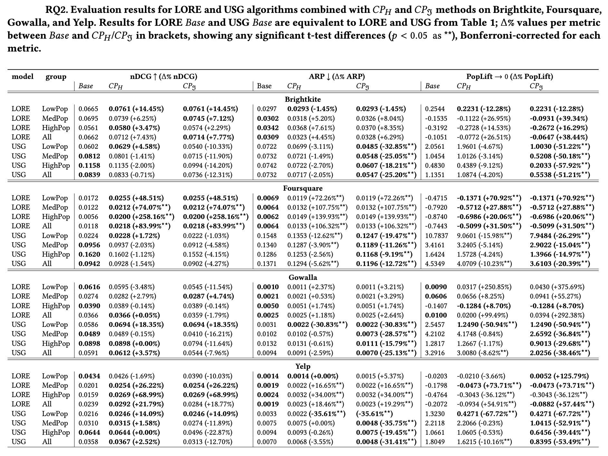

# Exploring the Effect of Context-Awareness and Popularity Calibration on Popularity Bias in POI Recommendations


## Abstract

Point-of-interest (POI) recommender systems help users discover relevant locations, but their effectiveness is often compromised by popularity bias, which disadvantages less popular yet potentially meaningful places. This paper addresses the challenge by evaluating the effectiveness of context-aware models and calibrated popularity techniques as strategies for mitigating popularity bias. Using four real-world POI datasets (Brightkite, Foursquare, Gowalla, Yelp), we analyze the individual and combined effects of these approaches on recommendation accuracy and popularity bias.
Our results reveal that context-aware models cannot be considered a uniform solution, as the models studied exhibit divergent impacts on accuracy and bias. In contrast, calibration techniques can effectively align recommendation popularity with user preferences, provided there is a careful balance between accuracy and bias mitigation. Notably, the combination of calibration and context-awareness yields recommendations that balance accuracy and close alignment with the users' popularity profiles, i.e., popularity calibration.


## Results

| Descriptive Statistics|
| --- |
| 


| Evaluation RQ1|
| --- |
| 

| Evaluation RQ2|
| --- |
| 


### RQ1 & RQ2. Comparing the item group ratios (T, M, H) in the user group's user profiles to the algorithms BPR $Base$ and LORE $Base$, and combined with the respective $CP_H$ and $CP_\Im$ ratios in the Yelp dataset (see Github for all distributions)

| Brightkite | Foursquare Tokyo |
| --- | --- |
|  |  |

| Gowalla | Yelp |
| --- | --- |
|  |  |


## Manual to Reproduce Results

The manual below includes all necessary steps (data sample generation, preprocessing, saving data files for plug-in into recommendation frameworks, re-ranking for popularity bias mitigation, accuracy-based evaluation, and user-centered evaluation) to generate baseline and re-ranked POI recommendations and evaluate their performance. To facilitate the reproducibility of the recommendations, we use the recommender frameworks [RecBole](https://github.com/RUCAIBox/RecBole) for general recommender models and [CAPRI](https://github.com/CapriRecSys/CAPRI) for Context-Aware Point-of-Interest Recommendation. 

#### Note: If you don't want to follow the entire pipeline, you can take a shortcut to the "General Evaluation" to perform this based on the results from the foursquaretky dataset.

### Preprocessing

1. create a virtual environment and activate it. 

Python < 3.12 (e.g., 3.11.8)
```
python3.11 -m venv venv
source venv/bin/activate
```
2. Install the requirements 
```
pip3 install -r requirements.txt
```
3. Create/update the script ```globals.py``` in the root directory and add the line ```BASE_DIR = /path/to/your/base/directory/```. This base directory will be used to store the datasets and the recommender outputs. 

Note: The dataset samples are provided for all four dataset, hence you can skip steps 4-5. \

4. In the ```BASE_DIR``` proceed by creating dataset folders with the following structure ```<dataset_name>_dataset``` and then place the original, (unzipped) data files in this folder.

Links to the original datasets used in this study: 
* [yelp_dataset](https://www.yelp.com/dataset)
* [gowalla_dataset](https://snap.stanford.edu/data/loc-gowalla.html)
* [brightkite_dataset](https://snap.stanford.edu/data/loc-brightkite.html)
* [foursquaretky_dataset](https://www.kaggle.com/datasets/chetanism/foursquare-nyc-and-tokyo-checkin-dataset)

5. Data Sampling & Preprocessing: Add the desired datasets to ```globals.py``` and call ```data_sampling.py```from the root directory. The samples include three user groups; 1/3 that visited the most popular POIs, 1/3 around the popularity median and 1/3 that visited the least popular POIs (default n=1500 users). The train/validation/test (65/15/20) splits are performed based on a user-based temporal split & duplicate check-ins are transformed into a check-in count. The samples are processed to fit the layout for RecBole and CAPRI and saved into the respective subfolders in the ```BASE_DIR```. 

### Generate Recommendations
Generate Recommendations using [RecBole](https://github.com/RUCAIBox/RecBole) for general recommender models and [CAPRI](https://github.com/CapriRecSys/CAPRI) for Context-Aware Point-of-Interest Recommendation. RecBole works as a pip package inside this project, CAPRI is a separate repository. 

#### Recbole 

1. Inside the folder ```recbole_general_recs/dataset``` create a folder with the structure ```<dataset name>_sample``` (e.g., foursquaretky_sample) & copy the files from your ```BASE_DIR/foursquaretky_dataset/processed_data_recbole``` into that folder. 

2. Hyperparameter optimization: has already been done and saved to recbole_general_recs/config - if you wish to re-do it, cd to recbole_general_recs and run ```python3 config_hyperparameter_creator.py``` -- see hyper.test for the tested parameters

3. cd back to the project's root directory, run: ```python3 recbole_general_recs/recbole_full_casestudy.py```
This creates a folder inside the ```BASE_DIR/<dataset>``` named "recommendations/BPR+timestamp including the config file that produced the recommendations, the general evaluation and the top_k_recommendations

4. Note: In case of an error in Recbole, try: \
```pip3 install hyperopt``` \
```pip3 install ray```  \
```pip3 install "ray[tune]"``` \
In the recbole package in your virtual environment, comment out the line #from kmeans_pytorch import kmeans in the following path: recbole/model/general_recommender/ldiffrec.py

In the hyperopt package, in hyperopt/pyll/stochastic.py", line 100, in randint
    return rng.integers(low, high, size) --> exchange rng.integers for rng.randint


#### CAPRI
To use [CAPRI](https://github.com/CapriRecSys/CAPRI), clone the repository and create a virtual environment. Make sure to use Python 3.9x. 

In the current repository, in the folder ```capri_context_recs``` you can find some files that need to be exchanged in the repository in order to fit our use case: 

1. switch out the ```requirements.txt```in CAPRI with the one in ```capri_context_recs/requirements.txt`` and install the packages inside your venv. 

2. switch out ```<CAPRI ROOT DIR>/config.py``` (because we added new data samples and must name them)
3. switch out ```<CAPRI ROOT DIR>/Data/readDataSizes.py``` (because we added new data samples and must name them)
4. switch out ```<CAPRI ROOT DIR>/Evaluations/evaluator.py``` (get Recommendations including scores since they are needed for the re-ranking)

5. Add our preprocessed sample datasets to CAPRI (e.g., ```BASE_DIR/foursquaretky_dataset/processed_data_capri```) to ```<CAPRI ROOT DIR>/Datasets/<dataset>_sample``` and follow the same naming convention as in RecBole (e.g., foursquaretky_sample). If you do so, there is no need to adapt readDataSizes.py and config.py, otherwise the folder names must be adapted in these 2 scripts. 

6. In the ```config.py```you can specify which contexts (Geographical, Social, Temporal, Interaction) each dataset features. For our study, social connections are not relevant, therefore we remove them from the data. Run the script ```main.py``` and choose the desired model and dataset. To reproduce the results, use "sum" fusion method. Create a folder with this exact structure in the ```BASE_DIR/datasets/<dataset>_dataset/recommendations``` subdirectory: ```<dataset>_sample-contextpoi-<model_name>-Jan-01-2024_09-00-00``` and manually place the respective Outputs/Eval_ and Outputs/Scores_ files for the respective model into this directory. Return to this repository, open the script ```capri_postprocessing.py```, specify the desired datasets and run the script to process the outputs (general evaluation and top-k recommendations) to be in line with those produced by RecBole.

Note: In case of an error in CAPRI try: If you produce multiple recommendations with the same model and dataset, you may have to delete the files inside ```<CAPRI ROOT DIR>/<Models>/<model name>/savedModels```to avoid errors. If you receive an error regarding the dataSize, it may help to include an empty file named socialRelations.txt with the dataset files. Check out their docs [docs](https://capri.readthedocs.io/en/latest/index.html) for further information.

### Popularity Calibration

1. call ```postprocess_baseline_top_k.py```from the root directory. 
2. call ```reranker.py```from the root directory. gridsearch = False since it is already included for foursquaretky for the best CP-parameters. If you wish to include additional datasets, set gridseatch = True to find the optimal lambda tradeoff parameters. This produces results for $CP_H$ and $CP_\Im$ inside ```BASE_DIR/datasets/<dataset>_dataset/recommendations/<model name>```

#### General Evaluation
The script ```offline_evaluation.ipynb```includes the full evaluation and plots. The evaluation metrics are found in ```evaluation_metrics.py```. 
The script ```descriptive_statistics.ipynb```gives you the stats for all available datasets and the script ```latex_table_creator.ipynb```helps to turn the results for RQ1 & 2 from the offline evaluation into latex tables. 


